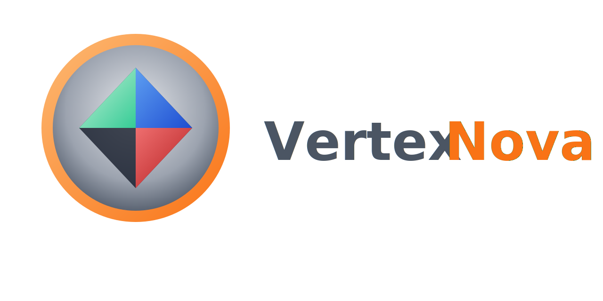

<p align="center">
  
</p>

<p align="center">
  <strong>Minimal C++ project template for the VertexNova ecosystem</strong>
</p>

<p align="center">
  <a href="https://github.com/vertexnova/vnetemplate/actions/workflows/ci.yml">
    
  </a>
  
  <a href="https://codecov.io/gh/vertexnova/vnetemplate">
    
  </a>
  
</p>

---

# VneTemplate

Minimal VertexNova-standard C++ template: CMake, deps (external + internal), tests, examples, and documentation. Use it as a starting point for new libraries or apps in the [VertexNova](https://github.com/vertexnova) stack.

## Directory layout

| Path | Description |
|------|-------------|
| `cmake/vnecmake/` | CMake modules submodule (ProjectSetup, ProjectWarnings, VneUseDep) |
| `configs/` | Configured headers (e.g. `config.h.in`) |
| `deps/external/` | Third-party deps (e.g. googletest) |
| `deps/internal/` | VertexNova internal libs (vnecommon, vnelogging) |
| `include/` | Public API headers (`vertexnova/template/`) |
| `src/` | Implementation |
| `tests/` | Unit tests (Google Test) |
| `docs/` | Doxygen input (`doxyfile.in`) and extra docs |
| `scripts/` | Helper scripts (build, format, generate-docs) |

## Prerequisites

- **CMake** 3.19 or newer  
- **C++20** compiler (e.g. GCC 10+, Clang 10+, MSVC 2019+)  
- **Doxygen** (optional, for `scripts/generate-docs.sh` and `-DENABLE_DOXYGEN=ON`)

## Dependencies

- **External:** Tests use [Google Test](https://github.com/google/googletest). Either add `deps/external/googletest` as a submodule (recommended tag: `v1.17.0`) or let CMake use FetchContent when the directory is missing.  
- **Internal:** **vnecmake** (required) is the CMake modules submodule at `cmake/vnecmake`. Optional libraries `vnecommon` and `vnelogging` go under `deps/internal/`. See [deps/README.md](deps/README.md). If they are missing, the template still builds but does not link to `vne::common` or `vne::logging`.

From the project root:

```bash
git submodule update --init --recursive
```

(Add submodules first if your repo uses them; see `deps/README.md`.)

## Build

From the project root:

```bash
cmake -B build -DCMAKE_BUILD_TYPE=Debug -DVNE_TEMPLATE_TESTS=ON
cmake --build build
```

Or use the platform scripts:

```bash
# macOS
./scripts/build_macos.sh -t Debug -a configure_and_build
./scripts/build_macos.sh -a test

# Linux (default compiler or -gcc / -clang)
./scripts/build_linux.sh -t Debug -a configure_and_build

# Windows (PowerShell)
.\scripts\build_windows.ps1 -BuildType Debug -Action configure_and_build
```

Options: `-t` build type, `-a` action (`configure` | `build` | `configure_and_build` | `test`), `-clean`, `-j N`. macOS also supports `-xcode` for Xcode project.

## Test

```bash
ctest -C Debug --test-dir build
```

Or:

```bash
./scripts/build_macos.sh -a test
```

## Documentation

- **Template overview and diagrams:** [docs/vertexnova/template/template.md](docs/vertexnova/template/template.md) — context and API diagrams (Draw.io sources in `docs/vertexnova/template/diagrams/`).
- **API docs:** Configure with Doxygen enabled and build the doc target:

  ```bash
  cmake -B build -DENABLE_DOXYGEN=ON
  cmake --build build --target vnetemplate_doc_doxygen
  ```

  Output: `build/docs/html/index.html`.

- **Script:** From project root:

  ```bash
  ./scripts/generate-docs.sh
  ```

  Use `--api-only` to only generate API docs, or `--validate` to only check links and coverage. See `./scripts/generate-docs.sh --help`.

## Format and tidy

- **clang-format:** Config in [.clang-format](.clang-format). Format in place or check only (CI):
  ```bash
  ./scripts/format.sh          # format sources
  ./scripts/format.sh -check   # check only (used in CI)
  ```
- **clang-tidy:** Config in [.clang-tidy](.clang-tidy). Generate `compile_commands.json` (e.g. `cmake -DCMAKE_EXPORT_COMPILE_COMMANDS=ON -B build`), then run `clang-tidy` or `run-clang-tidy -p build`.

## CI

GitHub Actions runs on push and pull requests to `main`: format check, clang-tidy, and build/test on Linux (GCC, Clang), macOS, and Windows. See [.github/workflows/ci.yml](.github/workflows/ci.yml).

## Contributing

See [CONTRIBUTING.md](CONTRIBUTING.md) for build, test, and style. We follow the [Contributor Covenant](CODE_OF_CONDUCT.md) Code of Conduct.

## Releases

Releases are managed by [release-please](https://github.com/googleapis/release-please). The **VERSION** file at the repo root is the single source of truth; CMake reads it at configuration time (via `file(READ)` in CMakeLists.txt) and uses that value for the project version, which is exposed in code as `get_version()`. Do not hand-edit CHANGELOG.md for versioned entries—use Conventional Commits (e.g. `feat:`, `fix:`) so the release PR updates CHANGELOG and VERSION and creates the tag. See [CONTRIBUTING.md](CONTRIBUTING.md).

## License

See [LICENSE](LICENSE).
